# Introduction

Natural Resources Canada (NRCan), in collaboration with the province of British Columbia, BC Assessment (BCA), FortisBC, local governments, and the private sector, has developed the TaNDM building energy and emissions inventory method. Its purpose is to support the development of privacy-compliant energy and emissions inventories of buildings at municipal, census tract, and neighborhood scales, improving the structure, quality, and geographical detail of building energy and emissions data over conventional inventory and survey approaches. TaNDM is an R&D initiative originally developed in 2010-2012 to explore opportunities for improving the granularity of B.C.’s [Community Energy and Emissions Inventory Reports](https://www2.gov.bc.ca/gov/content/environment/climate-change/data/ceei) for buildings, in response to municipal stakeholder needs. It was revitalized and updated in collaboration with the City of Kelowna in 2022-2024.

The TaNDM method was developed using a business analysis process to address challenges in building energy and emissions inventory data access and provision. Topics of buildings and energy data, data matching, aggregation, privacy compliance, and reporting were explored, informed by literature and expert knowledge. Perspectives were sought from an array of domains, including building science, property assessment, utility data management, municipal energy planning, building codes, and provincial policy. Data modeling and workflow solutions were developed and refined through a collaborative, iterative, and consensus-based approach.

The resulting TaNDM method is a bottom-up spatial and engineering method that links building, and measured utility data at the parcel scale, aggregating it by building vintage and category/type to neighborhood and municipal scales. Privacy is ensured by verifying that reported meter and energy data meets privacy compliance thresholds.

NRCan is pleased to make the TaNDM method open source and available for download, inspection, and modification under a GNU Lesser General Public License 3.0.  It is posted here on Github as a library of descriptions, tables, templates, diagrams, scripts and supporting documentation. Notably, this Github repository also contains the TaNDM 2021 Inventory Reports for Kelowna laid out in [human-readable/ print-ready](https://github.com/canmet-energy/tandm/blob/main/Kelowna_2021_inventory/TaNDM_Kelowna2021_INVENTORY_Github_Reading_Printing_FinalUpdated.xlsx) and [machine-readable/ analysis-ready](https://github.com/canmet-energy/tandm/blob/main/Kelowna_2021_inventory/TaNDM_Kelowna_2021_INVENTORY_Github_AnalysisReady_Final_Updated.xlsx) formats. UPDATE: A minor update was made to these files in May, 2025 to correct a data quality issue for one neighbourhood in Inventory Report 5. If you previously downloaded the inventories we suggest re-downloading the updated csv files.

Additionally, two peer reviewed journal articles are in press. The pre-print of the TaNDM Inventory article is available [here](https://papers.ssrn.com/sol3/papers.cfm?abstract_id=5129478). The validation article will be posted here when available.

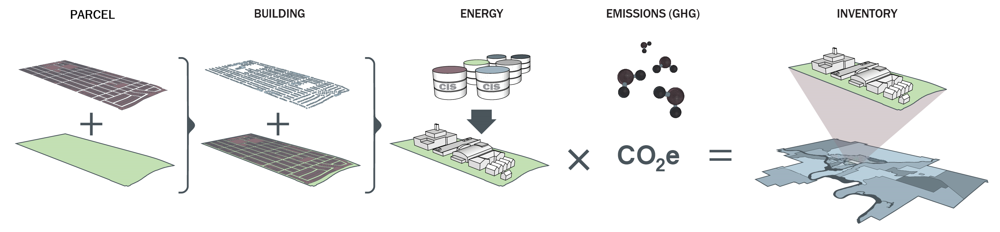

Parcel, buildings and meter data is spatially integrated and summarized at the parcel scale.

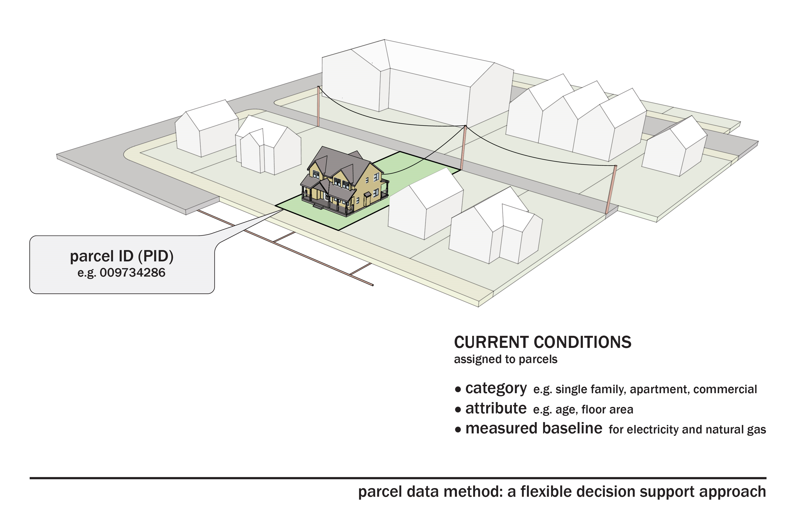

A variety of reports can be generated for different building category and vintage groupings, at different spatial scales, provided they meet pre-determined privacy compliance thresholds.

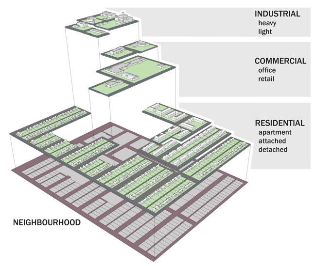

While this Github repository documents the method and results for Kelowna, B.C. the use and modification of the materials found here is encouraged to generate inventories for entire provinces or countries following this approach. Note that for successful execution of the TaNDM method, diverse stakeholder collaboration is a pre-requisite. Ensuring sufficient financial resources and having the right personnel in place to undertake significant data cleaning and integration is also advisable.

The TaNDM method is interdisciplinary, drawing on business analysis, building science, geospatial analysis and data science. It consists of the following distinct phases and topics:

- **Engage Stakeholders**: Steering committee, user story exercise, and workflow modeling

- **Prepare Parcel and Buildings Data**: Prepare or obtain a contiguous parcel fabric; Review priority building-related topics; Develop or Update Building Category Matrix, Obtain the Building Information Report; Prepare the Enhanced Building Information Report; Link EBIR to the parcel fabric.

- **Integrate Meter and Energy Data**: Feature Manipulation Engine (FME) workspaces for data integration

- **Aggregate Energy Data and Produce Privacy-compliant Energy Reports**: energy report conceptual design and templates, FME workspace for energy data aggregation, privacy thresholds and GHG emission factors

- **TaNDM Building Energy and Emissions Inventory Reports for Kelowna, B.C. (2021)**: data analysis and reading/printing versions available

- **Validation Exercise Method and Templates**: Filter building stock data to scope of stock model and connect meters, statistical validation exercise FME and Excel templates and Python script

A list of requirements for software environments for ArcGIS, Feature Manipulation Engine (FME) and Python packages can be found [here](https://github.com/canmet-energy/tandm/blob/main/TaNDM_Requirements.md). Note: One area for improvement in this repository is to create a requirements.txt file that can be installed by pip to support users to set up the computing environment for data processing. 

A list of acronyms related to TaNDM development and implementation in B.C. are as follows:
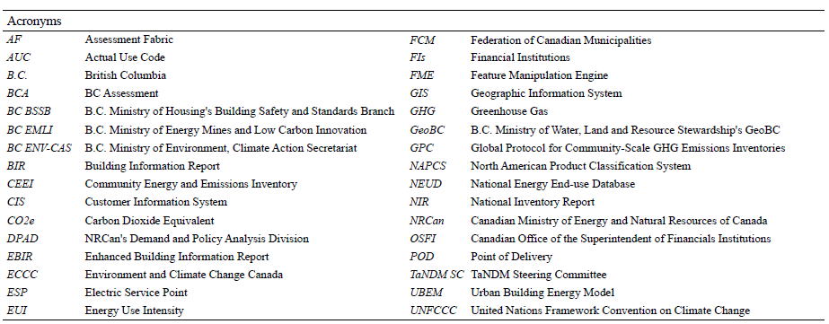

> **Note**: The method described here relies on datasets that belong to organizations other than NRCan. TaNDM users should anticipate entering data-sharing, collaboration agreements or contracts with organizations in their jurisdictions to access the required data or technical support to execute the method.

# Objectives

NRCan developed the TaNDM method to allow researchers, energy consultants, governments, and utilities to create privacy-compliant building energy and emissions inventories to support community energy and emissions planning with geographically granular data by building type and vintage.

A secondary objective for the Kelowna iteration and demonstration was to experiment with the use of the inventory data to validate NRCan’s CEE Map urban building energy model for Kelowna’s Part 9 low rise residential housing stock.

# Scope

The inventory component of this work has been developed and demonstrated in the province of British Columbia (B.C.) for energy and emissions inventory development, covering all building sectors: residential, commercial, institutional, industrial, and mixed use. It was originally developed in 2010-12 and updated and demonstrated in Kelowna, B.C. in 2022-24. The validation method developed for Kelowna, B.C. is limited to Part 9 low-rise residential dwellings.

# Original TaNDM Method

The original TaNDM method is documented in two project reports, a presentation and two-pager [available here as a zip file](docs/tandm_20102012_docs.zip) and a series of Python scripts [available here as a zip file](tandm_2010-2012_python.7z).

These are posted for historical reference. However, the focus of this GitHub repository is the updated TaNDM and demonstration results for Kelowna. Note that some report appendices have been redacted for copyright reasons.

# Engage Stakeholders

## TaNDM Steering Committee

Revitalizing the method after nearly a decade required re-engagement with former collaborators and identification of new collaborators. Presentations were made to relevant organizations, and individuals were identified for the TaNDM Steering Committee. The committee met monthly and attended one in-person workshop to review and confirm the approach. TaNDM Steering Committee Terms of Reference are available [here](docs/TaNDM_SteeringCommitteeTOR_FINAL.pdf). The report from the Victoria workshop is available [here](docs/TaNDMVictoriaWorkshopSummary.pdf).

The workplan consisted of stakeholder consultation and scope and objective confirmation, analysis and discussion of the method and priorities for its update. The Steering Committee was engaged in discussions on building and energy data topics and review of interim and final deliverables.

## User Story Exercise

Following a business analysis approach, a user story exercise was conducted to identify uses for building energy and emissions inventory data that aligned with TaNDM. A user story captures a concise statement of functionality or quality needed to deliver value to a stakeholder. A complete summary of the TaNDM User Story exercise is available [here](docs/TaNDM_UserStoryExercise_forGithub.pdf).

## Workflow Modeling

A swim lane diagram was iteratively developed over the course of the project to promote understanding of the TaNDM demonstration approach. The final version focusing on inventory development can be seen here:

# Prepare Parcel and Buildings Data

## Prepare Parcel Fabric

The Assessment Fabric (AF) from BC Assessment (BCA) was used, a parcel data layer available to B.C. local governments from [BCA](https://www.bcassessment.ca/) or [Integrated Cadastral Information Society](https://www.icisociety.ca/) members. AF preparation included flattening polygons to eliminate overlap and duplicates. For B.C., an alternative is [ParcelMap BC](https://ltsa.ca/products-services/parcelmap-bc/). Those in other jurisdictions should seek non-overlapping, authoritative parcel fabrics.

## Review Priority building-Related Topics

Buildings-related topics identified by the TaNDM steering committee for investigation for the purpose of updating the method included vintages, mixed use buildings and adding new building categories to the TaNDM Building Category Matrix. Significant work also went into the preparation of buildings data, namely enhancing Building Information Report (BIR) and matching it to the Assessment Fabric. The findings and methods used are outlined below.

## Vintage Analysis

A requirement of the TaNDM Steering Committee was to enhance the method by reporting energy and emissions data by vintage, further to the building category and type reporting enable by the original method. To identify preferring vintage year built ranges, the TaNDM Steering Committee reviewed common Canadian and project-relevant sources of vintages as follows:

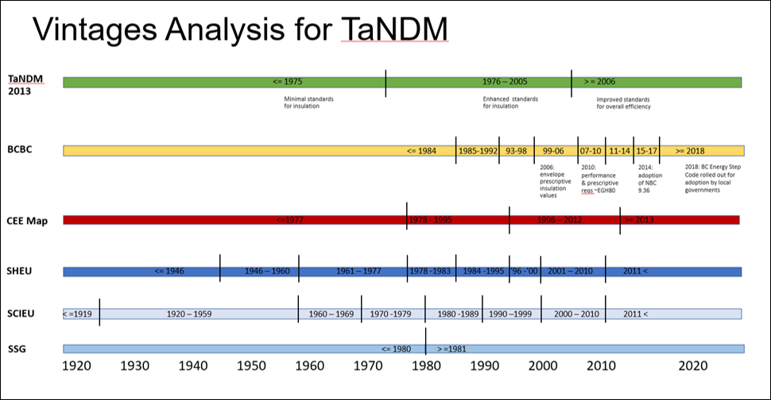

To support the model validation exercise, vintages in the CEE Map model were also used to group building energy reporting by vintage year-built range in TaNDM. These vintages were 1977 and prior, 1978-1995, 1996-2012, and 2013 and later, as depicted in this matrix:

Vintages were assigned to each parcel based on building year built, operationalized via the Enhanced_BIR.py python script, described below.

A recommendation made by the TaNDM Steering Committee was that future TaNDM implementations divide vintages by decade, with a pre-post date of 1980. In other words, if less resolution was required on vintages to meet privacy requirements that all buildings before 1980 could be one grouping and a second grouping all buildings in 1980 and after

The TaNDM Kelowna vintage matrix can be downloaded [here in .xlsx](csvs/VintageAnalysis.xlsx)

For implementation in jurisdictions outside B.C., vintages should be reviewed and confirmed with stakeholders so that buildings are categorized according to vintages that best meet stakeholder needs. Adjustments should be made to any “Enhanced Building Information Report” compilation and Energy Report templates accordingly.

## Mixed-use

Another requirement of the TaNDM Steering Committee was that reporting of mixed-use buildings also be improved. The updated method facilitates identification of parcels containing mixed-uses in two ways:

- Via BCA AUC codes (055, 202 and 203) – any parcel containing these codes is assigned-mixed use

- Via multiple major categories per parcel – in cases with multiple buildings per parcel, where two or more major categories existed these are also assigned a mixed-use designation.

## Develop or Update the TaNDM Building Category Matrix

The TaNDM Building Category Matrix [.xlsx](csvs/BuildingCategoryMatrix_forGithub.xlsx) and [.pdf](docs/BuildingCategoryMatrix_forGithub.pdf) supports energy data assignment to buildings at the most granular category level. The matrix, originally developed in 2010-2012 based on the observation that “different organizations categorize buildings differently." It was updated in 2022-24, an important new additional being the B.C. Building Code categories and Building Code Parts 9 and 3.

Additional lookup tables to support correct assignment of buildings to Actual Use Codes, Code Parts and Occupancy Codes are available here:

* [Actual Use Code .CSV](https://github.com/canmet-energy/tandm/blob/main/csvs/lut_ActualUseCode.csv)

* [Manual Class Code .CSV](https://github.com/canmet-energy/tandm/blob/main/csvs/lut_ManualClassCode.csv)

* [Occupancy .CSV](https://github.com/canmet-energy/tandm/blob/main/csvs/lut_occupanyc.csv)

* [Unit of Measure .CSV](https://github.com/canmet-energy/tandm/blob/main/csvs/lut_UnitOfMeasure.csv)

The assignment of building types within the Building Category Matrix is operationalized via a Python script described below.

Those seeking to implement TaNDM in jurisdictions outside of B.C. or Canada will need to develop a Building Category Matrix using buildings data classifications and terminology from their own jurisdiction. Users should expect to update the Python scripts to reflect any changes to the building category matrix. 

## Building Information Report (BIR)

BC Assessment developed the BIR arising from the original TANDM initiative (2010-2012), and municipal requirements for building attributes relevant for emissions inventory development. The BIR is produced annually and is available to B.C. local governments upon request. See the list of BIR attributes [here](https://github.com/canmet-energy/tandm/blob/main/docs/BIR_Data_Element_Description.pdf)

The above table is also available in [.csv](https://github.com/canmet-energy/tandm/blob/main/csvs/BIR_Attributes.csv).

The BIR must be enhanced with additional attributes and spatialized to support utilities in developing TaNDM energy reports.

## Enhanced Building Information Report (EBIR) linked to Assessment Fabric

Three topics were explored to create the EBIR:

* Additional attributes

* Building unit relationships

* Spatialize and flattening to parcel

[Additional attributes](csvs/EBIR_Attributes.xlsx) were added to the BIR for parcel attribution with building categories and vintages by taking the following steps:

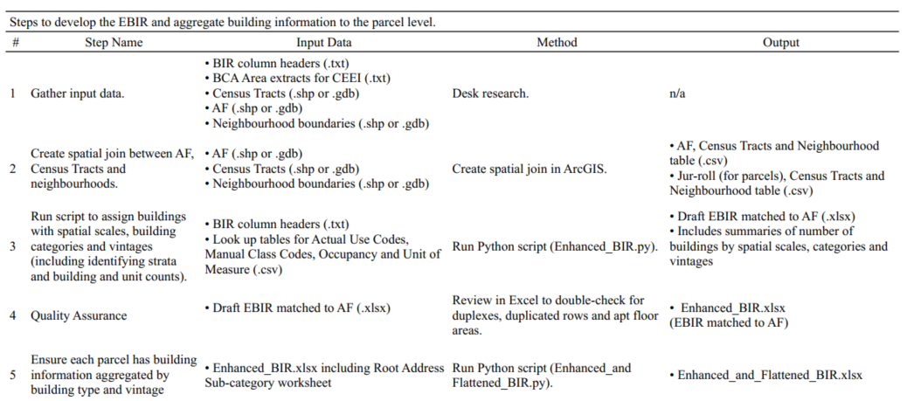

You can download an XLSX of the above table [here](csvs/Steps_to_the_EBIR.xlsx)

The [Enhanced_BIR.py](python/Enhanced_BIR.py) script mentioned in Step 3 of the above table assigns buildings with spatial scales, building categories and vintages (including identifying strata and building and unit counts). The following input data is required to execute this script:

* BIR-headers.txt: holds the field names of the BCAA Building Inventory Report

* CEEI_Extract_data.txt: holds the data from the BCAA Building Inventory Report

* ASSESSMENT_FABRIC_CENTROIDS_with_NEIGHBOURHOODS.csv: the resulting file from spatially joining the Assessment Fabric centroids with the Census Tract and Neighourhood polygons

This csv file must include these fields: Folio (from Assessment Fabric), Neighbourhood (from Neighbourhood boundaries), CT (from Census bounaries), X (from Assessment Fabric), Y(from Assessment Fabric)

* lut_ActualUseCode.csv: this file is from the TaNDM project and assigns building categories based on BCAA BIR Actual Use Code - it can be updated

* lut_ManualClassCode.csv: this file is from the TaNDM project and refines building categories based on BCAA BIR Manual Class Code - it can be updated

* lut_Occupancy.csv: this file is from the TaNDM project and refines building categories based on BCAA BIR Occupancy - it can be updated

* lut_UnitOfMeasure.csv: this file is from the TaNDM project and refines building categories based on BCAA BIR Unit of Measure - it can be updated

To change the definition of vintages, search for Allocate buildings to vintages

See additional comments in the .py to support execution.

A Jupyter Notebook is provided [here](python/Enhanced_BIR.ipynb) as an alternative way to implement the scripts.

The output of the Enhanced_BiR.py script (or notebook alternative) is the draft EBIR matched to AF in .xlsx format. This includes summaries of number of buildings by spatial scales, categories and vintages including identifying strata and building and unit counts. In Step 4 analysts should then conduct quality assurance to inspect the output to double check for duplexes duplicated and apartment floor area among other potential anomalies. For example, rouge parcels may not be assigned to neighbourhoods or Census Tracts.

It may not seem obvious at first why Step 5 in the above table is required however as any analyst handling building stock data particularly in larger urban centres will say, there is a lot of complexity in the built environment. Two key dimensions of this complexity are buildings with different types and vintages on the same parcel. For this reason, a second Python script [Enhanced_and_Flattened_BIR.py](python/Enhanced_and_Flattened_BIR.py) is provided to ensure each parcel has building information aggregated by building type and vintage. This is necessary to simplify reporting of building type and vintage in parcels with buildings of more than one type and/or vintage.  This step is critical to enable utilities to assign energy use efficiently to parcels.

A Jupyter Notebook is provided [here](python/Enhanced_and_flattened_BIR.ipynb) as an alternative way to implement the scripts.

The output of this step is the Enhanced_and_Flattened_BIR.xlsx which is provided to the utility as an input to the FME models that support integration of meter and energy data.

> **Note**: The method described here relies on datasets that belong to organizations other than NRCan. Because the buildings data and energy consumption data at the parcel/building/meter scale are proprietary sample data is not provided in the current deployment of the TaNDM github to preserve commercial confidentiality of the input datasets. It is hoped that sufficient attribute information is provided to enable proponents to work with their own buildings and energy data to execute the scripts and produce EBIR-like data products and energy reports. A sample placeholder dataset may be provided in future to support experimentation with the method. Also note that users should anticipate updating the scripts to reflect building attributes and their nomenclature for the jurisdiction in which it's being implemented. This could include for jurisdictions within B.C. as we have been advised there may be slight naming discrepancies between local governments or over time. 

# Integrate Meter and Energy Data

The integration process used FortisBC’s GIS and parcel polygons, with a one-to-many and many-to-many relationship between parcels, buildings, and meters. Two FME workspaces are provided as examples with images to illustrate the models, to make their design accessible to anyone even non-FME users. It should be noted that because this work involves integrating the parcel, building and utility meter data at the parcel scale, this part of the workflow was done internaly by the utility to adhere to privacy and commercial-confidential requirements. For the TaNDM Kelowna demonstration the FortisBC GIS manager oversaw the work, with work performed by a GIS analyst using a combination of ArcGIS and FME. In the 2010-2012 TaNDM iteration, the integration work was completed in Python (see the historical files above for those scripts). 

1. FME workspace that merges parcel polygons assigned with EBIR attributes with gas and electric meter xy points.

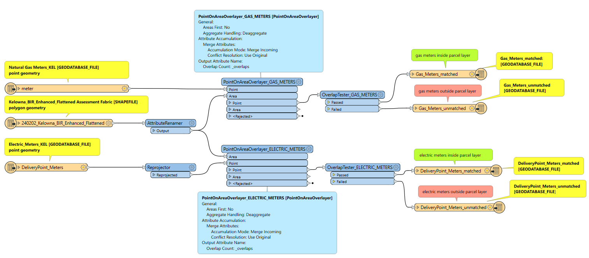

The exemplar FME workspace is available here for FME users **[1_ParcelFabric_EBIR_Meter_Merge.fmw](fme/1_ParcelFabric_EBIR_Meter_Merge.fmw)**

2. FME workspace that connects meters already matched to parcels with their respective energy data.     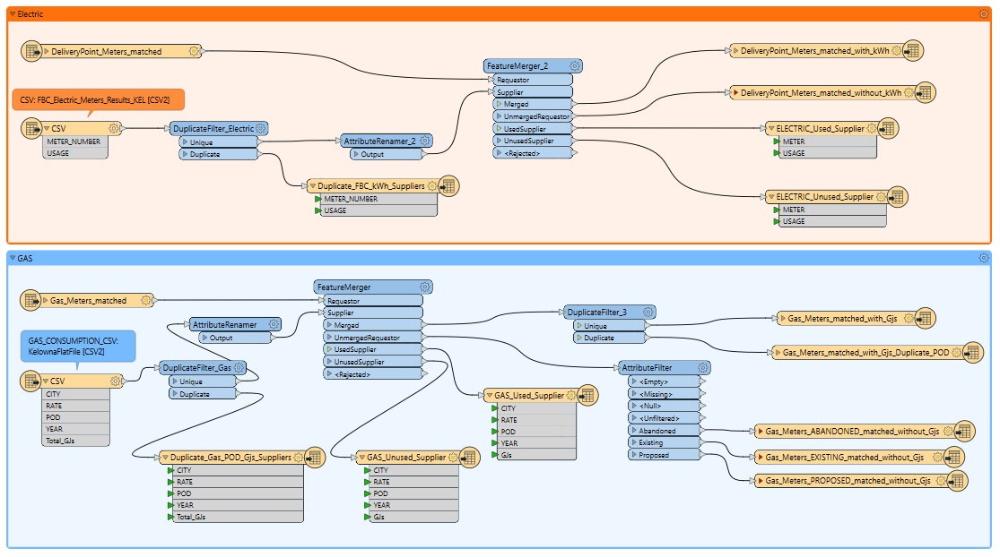

Note that this workspace contains two distinct workflows, one for electric and the other natural gas.

**[2_AttachEnergytoGasElectricMeters.fmw](fme/2_AttachEnergytoGasElectricMeters.fmw)**

# Aggregate Energy Data and Produce Energy Reports

At the TaNDM workshop held in Victoria, B.C. in November 2022 six TaNDM reports were proposed for compilation based on stakeholder requirements. When building and energy data is connected at the parcel scale, as is enabled by the TaNDM method, there is considerable flexibility as to how the data is aggregated for reporting.

TaNDM enables data aggregation on the three parameters: spatial scale, building category and type and vintage. Conceptual diagrams were generated to support TaNDM collaborators to review and confirm proposed outputs, including the trade-offs that would need to be made in report granularity to ensure privacy compliance.

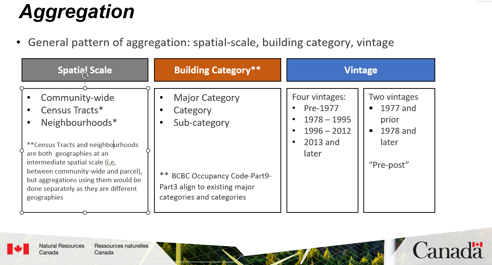

## Energy Reports

Six reports were proposed at different levels of aggregation. Reports 1 through 4 report at the community-wide or municipal scale and demonstrate greater granularity on building categories and vintages including reporting by Building Code Parts 9 and 3 (Report 3) and BC Building Code Categories (Report 4).

In contrast, Reports 5 and 6 sit at lower geographies neighbourhoods (called Growth Nodes in Kelowna) and Census Tracks respectively. Granularity is lost on vintage, with all building categories aggregated to all vintages or all years. Granularity is also lost on building category, with reporting occurring at the major category level when the geographic scale is lowered.

Below are diagrams of the six proposed reports, which indicate for each, the hoped for final report with a gold star. Also linked below are. xlxs energy report templates, oriented, to support reporting by the utility. Scroll down for the final TaNDM inventory reports for Kelowna.

-**Energy Report 1**: Major building category, up to four vintages

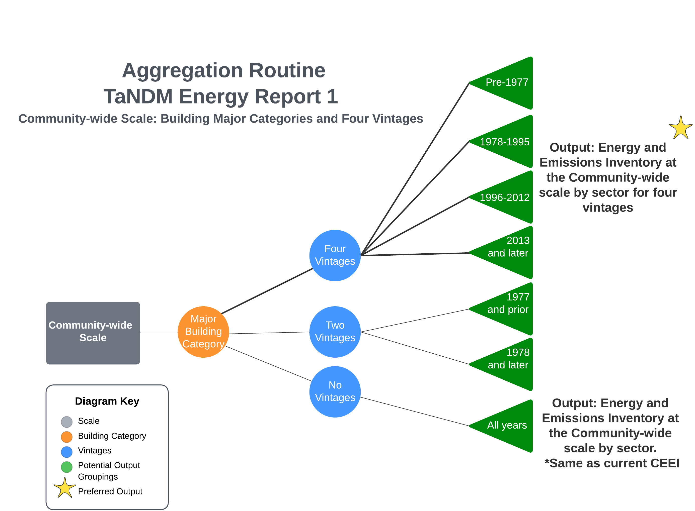

-**Energy Report 2**: Building sub-category, two/no vintages

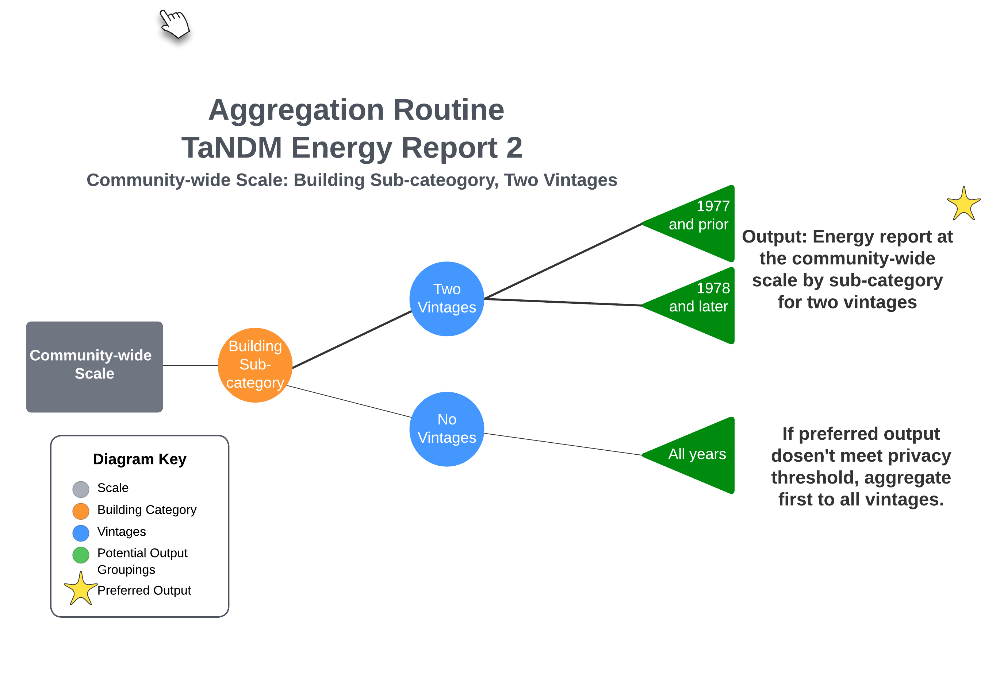

-**Energy Report 3**: Building Code Parts (3 & 9), four vintages

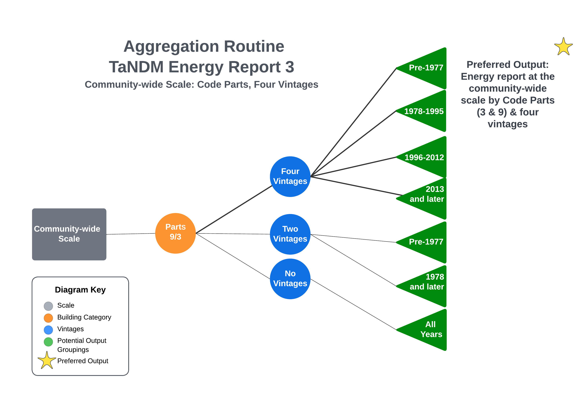

-**Energy Report 4**: BCBC Occupancy Codes, up to four vintages

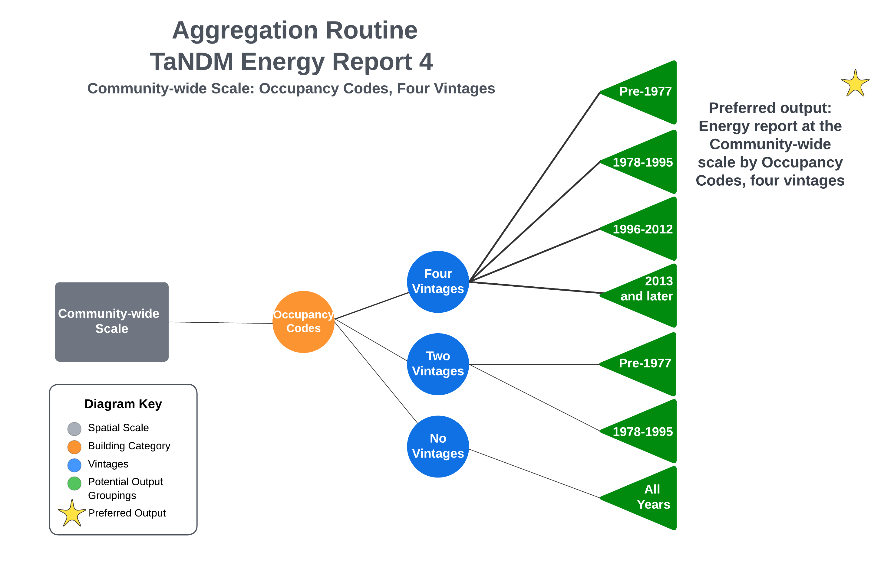

-**Energy Report 5**: Neighborhood scale, major building category, up to four vintages

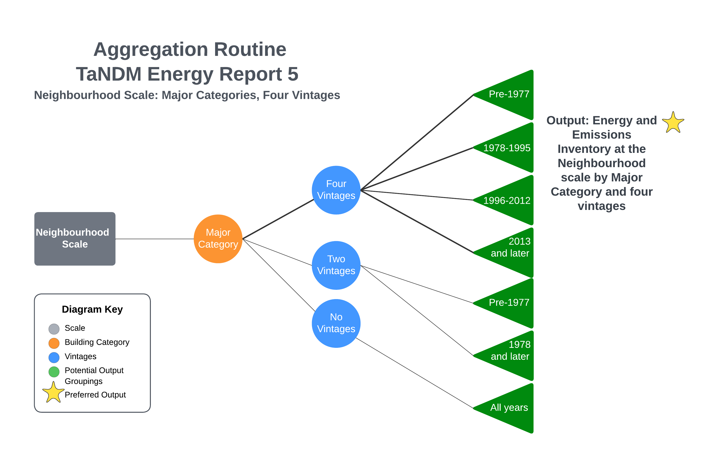

-**Energy Report 6**: Census Tract scale, major building category, up to four vintages

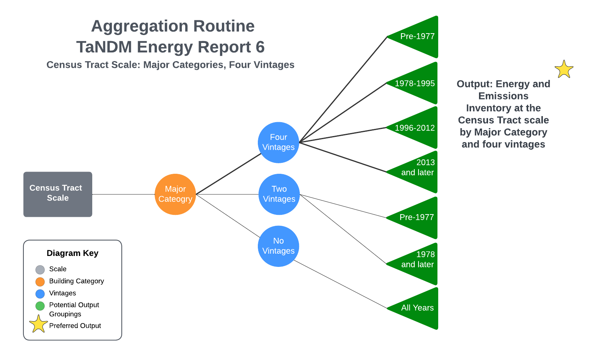

[Energy Reports Template .XLSX](csvs/EnergyReportTemplate-forGITHub.xlsx)

Prospective TaNDM users can either re-use these aggregations and report templates or consult with stakeholders to modify aggregations to best suit their needs. If any new building categories or types are proposed, these would first need to be integrated into the Building Category Matrix and then assigned to individual dwellings.

The following table describes a step by step approach to achieving aggregated energy reports with TaNDM.

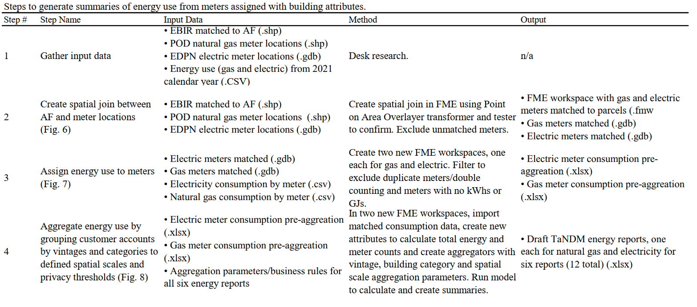

In practice, aggregation was automated using FME workspaces. FME supports the generation of multiple output reports in one workspace, through the specification of multiple writers to export data to .XLSX. A third FME workspace is provided to support aggregation to the six energy reports. Note this workspace has two separate workflows, one for electricity:

And the second for natural gas:

- **[3_KwH_GJ_Meter_to_Report_Aggregation.fmw](https://github.com/canmet-energy/tandm/blob/main/fme/3_KwH_GJ_Meter_to_Report_Aggregation.fmw)

## Privacy Compliance

Using available buildings data, the TaNDM team used the energy report templates prepared building and unit counts to illustrate for the utility where the privacy thresholds were at risk of not being met. An important distinction however is that  utilities define customers based on meter counts not building or unit counts. One meter is one customer, which can be thought of as the privacy unit of measure in conjunction with established thresholds. TaNDM privacy thresholds are based on pre-established Community Energy and Emissions inventory criteria with two distinct thresholds:

- a grouping must have no less than five customers; and

- no one customer in any grouping can consume 50% or more of the load.

Following the aggregation in FME, XLS files were output which were manually checked with further aggregations completed by the utility to ensure both privacy thresholds were met in all instances. Manual aggregations were done first by combining accounts in vintages not meeting the privacy thresholds, followed by building categories. Reports also have an aggregated category for customer accounts that couldn’t be reported on a more granular basis.

An important lesson learned through this process was that buildings data wasn’t reported back out by the utility along with meter counts and consumption data per grouping. Building and unit counts had to be manually re-integrated to produce the final TaNDM reports. It’s recommended that buildings data both be sent into the utility and linked to the parcels and meters, as illustrated in FME workspaces 1 and 2 above. FME workspace 3 however should be modified to “pull the buildings data through” along with the energy and meter count data.

## Greenhouse Gas Emissions Factors

Scope 1 emissions from natural gas were calculated based on emissions factors of 0.04985 TCO2e/GJ in the most recent National Inventory Report by Environment and Climate Change Canada (ECCC). Scope 2 emissions from domestic electricity used a factor of 0.00000256 TCO2e, based on a three-year rolling average of emissions from B.C. owned-and-operated facilities, excluding imported electricity. Scope 2 emissions including both domestic and net imported electricity were calculated using a factor of 0.0000097 TCO2e based on a four-year rolling average for the integrated (southern and western B.C.) grid. All electrical emission intensity factors are reported in tonnes of carbon dioxide equivalent per Gigawatt-hour (TCO2e/GWh).

References for the factors used are [here](https://www.ipcc.ch/report/2019-refinement-to-the-2006-ipcc-guidelines-for-national-greenhouse-gas-inventories/) and [here](https://publications.gc.ca/collections/collection_2024/eccc/En81-4-2022-2-eng.pdf).

# TaNDM Building Energy and Emissions Inventory Reports for Kelowna, B.C. (2021)

Reports are available for download in two formats:

Analysis-ready version, one column header:

[TaNDM 2021 Inventory Reports for Kelowna, B.C. - Analysis Ready Version, .xlsx](https://github.com/canmet-energy/tandm/blob/main/Kelowna_2021_inventory/TaNDM_Kelowna_2021_INVENTORY_Github_AnalysisReady_Final_Updated.xlsx)

Reading and printing version, multiple column headers:

[TaNDM 2021 Inventory Reports for Kelowna, B.C. - Reading, Printing Version, .xlsx](https://github.com/canmet-energy/tandm/blob/main/Kelowna_2021_inventory/TaNDM_Kelowna2021_INVENTORY_Github_Reading_Printing_FinalUpdated.xlsx)

The TaNDM energy and emissions inventory reports for Kelowna will also be posted to the B.C. Ministry of Environment’s Community Energy and Emissions Inventory page available [here](https://www2.gov.bc.ca/gov/content/environment/climate-change/data/ceei).

# Validation Exercise

The primary objective of the TaNDM methodology is to develop building energy and emissions inventories at the community and neighbourhood scales. A secondary objective set out in the Kelowna B.C. TaNDM iteration was to validate NRCan’s CEE Map model for Kelowna’s Part 9 low rise residential housing stock.

Because model accuracy is of concern for planners, policy makers and building performance simulation professionals, it is logical to consider data access for inventory development and model validation together. Importantly, topics such as building categories and data structure are common to both.

Due to the utility being limited in the buildings data being integrated, specifically not having individual floor area data, heating fuel source (at least within the GIS department). Data compiled based on dwelling type and vintage, not the archetypes in the CEE Map model which had been defined based on dwelling type, vintage, heating fuel source and size.

The following steps were undertaken to ensure only dwellings in the CEE Map model were provided to the utility to extract associated energy use for the validation exercise:

* Filter EBIR to Contain Only CEE Map dwellings

* Attach CEE Map Dwellings to Meters

## Filter EBIR to Contain Only CEE Map Dwellings

The building stock of the CEE Map model was a sub-set of the building stock being inventoried by TaNDM. It was therefore necessary to filter the EBIR and provide a separate EBIR linked to the Assessment Fabric for the utility to match with its meters.

Each dwelling in the CEE Map model contained a Kelowna ID (KID) unique numeric identifier. The City of Kelowna provided a table that assigned each KID to a jurisdiction and roll number. This supported identification of which EBIR folios were contained in the CEE Map model and enabled the TANDM team to extract only the EBIR records for low-rise part 9 residential dwellings that were in scope for the model. This was undertaken as a matching process in Excel.

## Attach CEE Map Dwelling to Meters

The FME workspace developed by the utility for this can be found below:

[4_CEEMap_Dwellings_Attached_to_Meters.fmw](https://github.com/canmet-energy/tandm/blob/main/fme/4_CEEMap_Dwellings_Attached_to_Meters.fmw)

## Statistical Test to validate model and validation spreadsheet template

A literature review was completed, and the K-S statistical test was chosen. A spreadsheet template was developed to share the modelled data on an individual dwelling unit level with the utility and also provide a location for the individual meter level annual consumption data from the utility to be organized from lowest to highest by dwelling type and vintage. This workbook also dynamically generates histograms to enable visualization of the measured and modelled data by dwelling type, vintage and energy source.

Sample histograms are shown here to illustrate the outputs generated when measured and modelled data is input into the spreadsheet template. The histogram immediately below is for total annual modelled and measured natural gas use, for the 2021 year in single detached dwellings built in 1977 and before in Kelowna, B.C. The x-axis gives the gigajoules per year (GJ/yr). The left-hand side Y axis gives the dwelling unit counts as per BC Assessment and City of Kelowna single detached dwelling units for that vintage. The right-hand side y axis gives the corresponding gas meter count. Of note is that modelled data is reflected in blue bars and measured data is reflected in red bars. The modelled natural gas consumption in blue corresponds to dwelling units on the left and the measured natural gas consumption in red correspond to meter counts, also referred to as customers, on the right. It may be observed in this sample histogram that the modelled data has a bi-modal distribution with consumption skewing higher. Conversely, the red bars show measured consumption for more meters skewing lower and having a normal, not bi-modal, distribution.  

The histogram below is for electricity use in single detached dwellings built in 1977 and prior in Kelowna, B.C. The X axis reflect annual energy in kilowatt hours (kWh/yr) and the Y axes are the same as the natural gas histogram above, reflecting unnits and electric meter counts on the left and right-hand sides respectively. A bi-modal distribution can also be seen in the modelled data. For electricity this reflects differences in dwellings that are assumed to have electric resistence heating (the right-hand side of the bimodal distribution) and those using electricity for lighting, appliances and fans with space heating coming from natural gas (the left-hand side of the bi-modal distribution).  

Using this completed spreadsheet as an input the Python script was then used to run the K-S test, calculated per dwelling type, vintage and energy source based on the distributions of measured and modelled data.
[K-S.py](https://github.com/canmet-energy/tandm/blob/main/python/K-S.py) 

Complete results are contained in a peer reviewed journal article, a link to which will be posted here when available.

# Recommendations for producing fit for purpose utility data for UBEM model validation

Fit for purpose data for modellers to validate urban building stock energy models can be more easily generated by a utility if the parcel, building, meter and energy use data are integrated, as is supported by the TaNDM method. Further areas of exploration for fit for purpose utility data access for UBEM model validation include:

- Structuring measured utility data for model validation purposes based on the same characteristics on which modelled housing archetypes and by extension the output model data are defined

- Further to the named assignment of building type and vintage at the parcel scale as demonstrated in TaNDM, assigning counts of buildings and units to meters at the meter scale.

- Assign heating fuel type to the meter

# Using TaNDM in your organization 
The TaNDM method is made available under an open-source GNU Lesser General Public License V.3 which you may see [here]. You are welcome to download all materials posted here for use in your organization, provided that you give credit or acknowledge NRCan when they are used. You are under no obligation to share result of analysis, of either micro data or aggregated data. The method may be used for internal business purposes and analysis. If however you or your team make improvements to the method, such as extending it to serve new use cases, a requirement of the license is that any improvements also be made publicly available, ideally through being posted here. To do so, create a new branch of this repository, add your content and create a pull request to merge the branches. The merge will be managed by CanmetENERGY-Ottawa. Thanks in advance for your contributions! 

# Acknowledgements

This work was supported by the Program of Energy Research and Development via the Canadian Energy End-use (CEE Map) project (CEO-4006) and the Canada Green Buildings Strategy. TaNDM was originally developed via the Integrated Community Energy Modelling project supported by NRCan’s Clean Energy Fund (0078CE).

TaDNM was led in the 2010-2012 timeframe by Per Wallenius who was with GeoBC at the time. Jessica Webster was project sponsor and technical authority via NRCan. Brett Korteling developed spatial data routiens and Python scripts based on stakeholder requirements. Original TaNDM 2010-12 proponents and participants including Ted Sheldon, Mary Storzer, Per Wallenius, Ron Kellet, Caroline Jackson, Allison Ashcroft, Steve Young, Adrian Mohareb, Kim Boyd, Michael Wilson, Shana Johnstone, Nicole Miller, Dennis Nelson, Travis Streb, Bob Davidson, David Bailey, Jeff Carmichael, Kate Miller, Alison Stewart and Jeff Ragsdale. 

In the 2013 to 2021 timeframe, the methodology was maintained by the BC Minstry of Environment and Climate Action Secretariat managed by Ben Clark leading in 2012-2013. Ken Porter took over the file in 2013 and managed intellectual property licensing. 

Ken Porter and Jessica Webster co-led the revitalized TaNDM 2022-2024 Kelowna iteration. Once again, Brett Korteling completed much of the spatial analysis to handle the building stock data including developing Python scripts. Ted Norcott from FortisBC developed the FME modles and completed the meter matching and energy data integration and reporting. Other TaNDM Steering Committee members that contributed input and review to the method update and demonstration included: James Allen, Jaime-Ann Lew, Matthew Wood, Max Mathies, and Sharan Mahli from FortisBC; Tamara Sears from B.C. Assessment; Chris Ray, City of Kelowna; Nairn Albrecht, Prabatha Hewa from B.C. Ministry of Energy, Mines and Low Carbon Innovation; Elizabeth Lytviak from the B.C. Ministry of Environment and Climate Strategy; Gurdeep Singh and Ysabel Garcia from GeoBC; Joe Wang from NRCan’s Demand and Policy Analysis Division, Yuill Herbert of Sustainability Solutions Group and Aaron Licker from Licker Geospatial. 

Maya Papineau and Ekaterina Alekhanova from Carleton University supported the CEE Map validation exercise. Support for Carleton University was through the Social Sciences and Humanities Research Council (SSHRC) grant number is 890-2020-0099.

# Contact

We welcome your input on improving and extending the TaNDM method. Further to logging issues for improvements to this repository via the Github issues function please contact Jessica Webster at jessica.webster@nrcan-rncan.gc.ca or Ken Porter at Kenneth.porter@gov.bc.ca 

